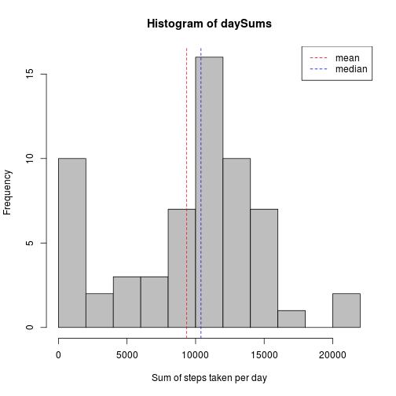
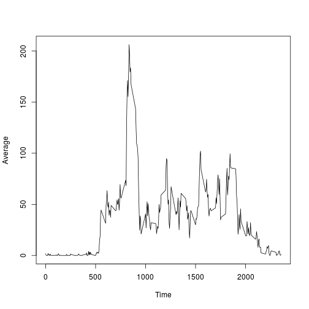
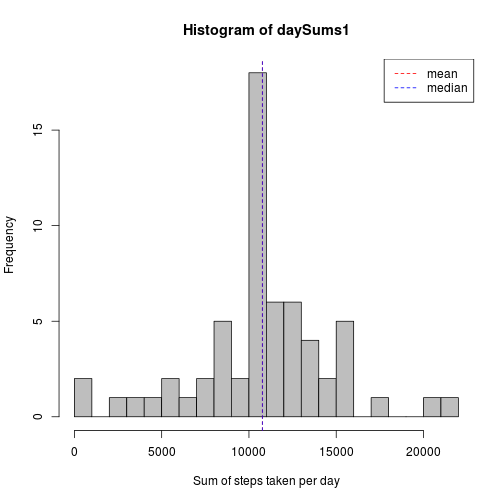
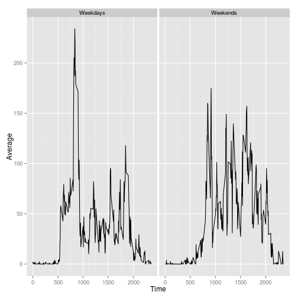

### Loading and preprocessing the data  

Reading the data here is straightforward, we simply use the read.csv command with its defaults. We also run the ggplot2 package for later use
   
   

```r
library(ggplot2)
library(reshape2)
data <- read.csv('activity.csv')
```


## What is mean total number of steps taken per day?

To calculate the total steps taken per day, we use the tapply function with the date as our factor.


```r
daySums <- tapply(data$steps, data$date, sum, na.rm=TRUE)
daySums
```

```
## 2012-10-01 2012-10-02 2012-10-03 2012-10-04 2012-10-05 2012-10-06 
##          0        126      11352      12116      13294      15420 
## 2012-10-07 2012-10-08 2012-10-09 2012-10-10 2012-10-11 2012-10-12 
##      11015          0      12811       9900      10304      17382 
## 2012-10-13 2012-10-14 2012-10-15 2012-10-16 2012-10-17 2012-10-18 
##      12426      15098      10139      15084      13452      10056 
## 2012-10-19 2012-10-20 2012-10-21 2012-10-22 2012-10-23 2012-10-24 
##      11829      10395       8821      13460       8918       8355 
## 2012-10-25 2012-10-26 2012-10-27 2012-10-28 2012-10-29 2012-10-30 
##       2492       6778      10119      11458       5018       9819 
## 2012-10-31 2012-11-01 2012-11-02 2012-11-03 2012-11-04 2012-11-05 
##      15414          0      10600      10571          0      10439 
## 2012-11-06 2012-11-07 2012-11-08 2012-11-09 2012-11-10 2012-11-11 
##       8334      12883       3219          0          0      12608 
## 2012-11-12 2012-11-13 2012-11-14 2012-11-15 2012-11-16 2012-11-17 
##      10765       7336          0         41       5441      14339 
## 2012-11-18 2012-11-19 2012-11-20 2012-11-21 2012-11-22 2012-11-23 
##      15110       8841       4472      12787      20427      21194 
## 2012-11-24 2012-11-25 2012-11-26 2012-11-27 2012-11-28 2012-11-29 
##      14478      11834      11162      13646      10183       7047 
## 2012-11-30 
##          0
```
     
Below is a histogram of the total steps taken each day, with the mean and median displayed.


```r
hist(daySums, breaks = 10, col = 'grey', xlab = 'Sum of steps taken per day')
abline(v = mean(daySums), lty=2, col = 'red')
abline(v = median(daySums), lty=2, col = 'blue')
legend('topright', c('mean', 'median'), col = c('red', 'blue'), lty = c(2, 2))
```

 
   
We can also see the exact values of the mean and median.
   

```r
mean(daySums)
```

```
## [1] 9354.23
```

```r
median(daySums)
```

```
## [1] 10395
```
     
## What is the average daily activity pattern?
   
Similarly to before, we use the tapply function to apply the mean over a factor of intervals.


```r
dailyAvg <- tapply(data$steps, data$interval, mean, na.rm=TRUE)
plot(names(dailyAvg), dailyAvg, type = "l", xlab = 'Time', ylab = 'Average')
```

 

We can also find and return the time interval containing the max mean number of steps.


```r
dailyAvg <- as.data.frame(dailyAvg)
dailyAvg$Time <- rownames(dailyAvg)
dailyAvg$Time[which(dailyAvg[1] == max(dailyAvg[1]))]
```

```
## [1] "835"
```

So our answer is 8:35-8:40.


## Imputing missing values

To see how many NAs exist in our data, we use the is.na function.      


```r
table(is.na(data$steps))
```

```
## 
## FALSE  TRUE 
## 15264  2304
```
     
So we have 2304 NA values, to replace them I looped over the data frame and replaced with the average value for that time interval.


```r
data1 <- data
data1$interval <- as.character(data1$interval)
for(i in 1:length(data1$steps)){
  if(is.na(data1$steps[i])){
    data1$steps[i] <- dailyAvg[data1$interval[i],1]
    }
  }
head(data1)
```

```
##       steps       date interval
## 1 1.7169811 2012-10-01        0
## 2 0.3396226 2012-10-01        5
## 3 0.1320755 2012-10-01       10
## 4 0.1509434 2012-10-01       15
## 5 0.0754717 2012-10-01       20
## 6 2.0943396 2012-10-01       25
```

```r
head(data)
```

```
##   steps       date interval
## 1    NA 2012-10-01        0
## 2    NA 2012-10-01        5
## 3    NA 2012-10-01       10
## 4    NA 2012-10-01       15
## 5    NA 2012-10-01       20
## 6    NA 2012-10-01       25
```
     
As you can see, data1 has the NA values from the original data frame replaced with the averages for that interval.     

     

```r
daySums1 <- tapply(data1$steps, data1$date, sum, na.rm=TRUE)
hist(daySums1, breaks = 20, col = 'grey', xlab = 'Sum of steps taken per day')
abline(v = mean(daySums1), lty = 2, col = 'red')
abline(v = median(daySums1), lty = 2, col = 'blue')
legend('topright',c('mean', 'median'), col = c('red', 'blue'), lty=c(2, 2))
```

 
   
The plots look very different, we can also see the exact values of the mean and median which are the same now.     

   

```r
mean(daySums1)
```

```
## [1] 10766.19
```

```r
median(daySums1)
```

```
## [1] 10766.19
```


## Are there differences in activity patterns between weekdays and weekends?

First we have to do some manipulating of the data to sort between weekdays and weekend. Then we perform similar operations as before to find the average of each time interval, but this time weekdays and weekends are separated. Finally, we plot.    


```r
data$date <- weekdays(as.POSIXct(data$date))
for(j in 1:length(data$date)){
  if(data$date[j] %in% c('Saturday', 'Sunday')){
    data$date[j] <- 'Weekend'
    } else {
      data$date[j] <- 'Weekday'
    }
  }
dayAvg <- tapply(data[data$date == 'Weekday', ]$steps, data[data$date == 'Weekday', ]$interval, mean, na.rm=TRUE)
endAvg <- tapply(data[data$date == 'Weekend', ]$steps, data[data$date == 'Weekend', ]$interval, mean, na.rm=TRUE)
dayAvg <- as.data.frame(dayAvg)
dayAvg$Time <- rownames(dayAvg)
dayAvg$endAvg <- endAvg
rownames(dayAvg) <- c()
colnames(dayAvg) <- c('Weekdays', 'Time', 'Weekends')
dayAvg <- melt(dayAvg, id = 'Time')
dayAvg$Time <- as.numeric(dayAvg$Time)
ggplot(dayAvg, aes(x=Time, y=value)) + geom_line() + ylab('Average') + facet_grid(~variable)
```

 
